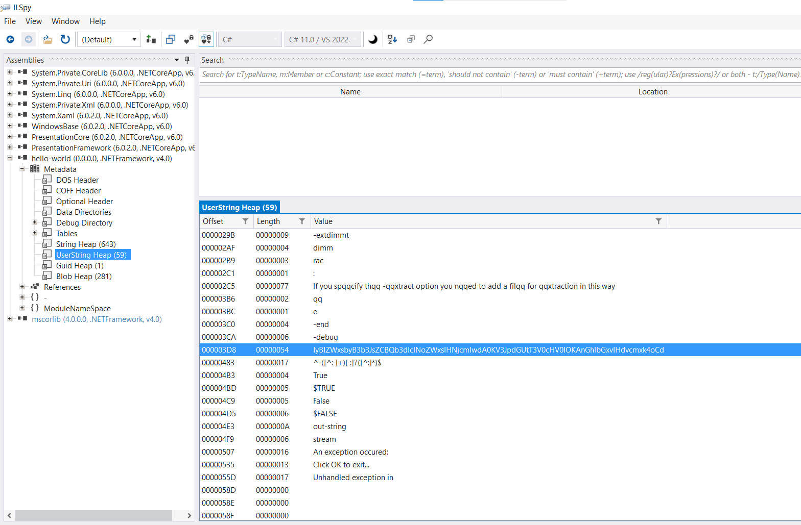

# Win-PS2EXE

https://github.com/MScholtes/PS2EXE

Program to convert Powershell script to EXE.

Version(s) tested:
- 1.0.1.1

## Detect

Strings found
```

```

## Decompile

Tools required
 - [ILSpy](https://github.com/icsharpcode/ILSpy/releases)

Steps
 - Open executable (EXE) with ILSpy
 - In Assemblies pane go to `<executable name> \ Metadata \ UserString Heap \ `
 - Look for base64 encoded string 
 - Decode base64 encoded string to retrieve the script
 
 
 
 e.g. 
``` IyBIZWxsbyB3b3JsZCBQb3dlclNoZWxsIHNjcmlwdA0KV3JpdGUtT3V0cHV0IOKAnGhlbGxvIHdvcmxk4oCd ```
decodes to 
```powershell
# Hello world PowerShell script
Write-Output “hello world”
```
 
 


